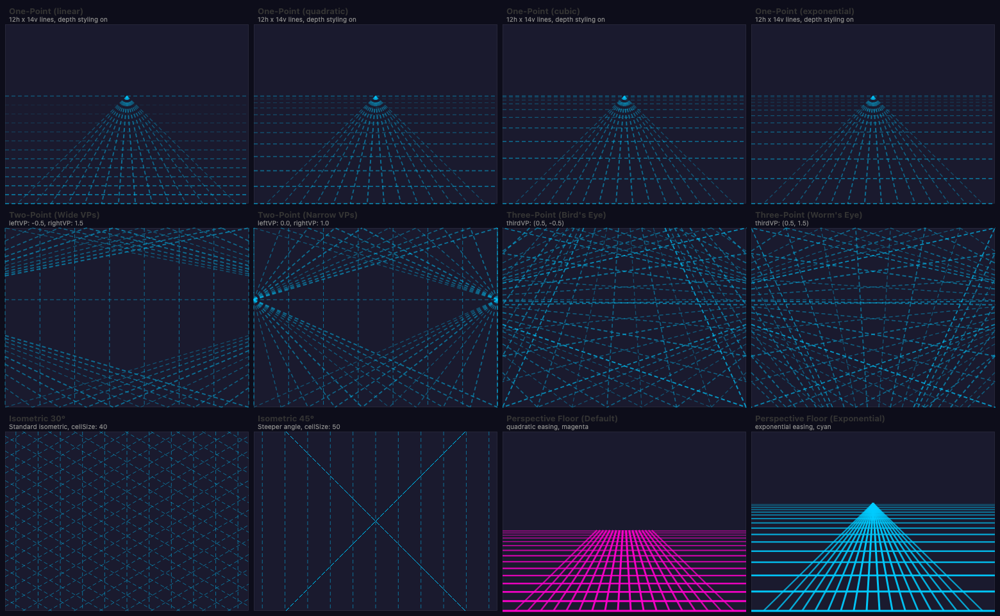

# @genart-dev/plugin-perspective

Perspective grid and floor design layer plugin for [genart.dev](https://genart.dev) — overlay one-point, two-point, three-point, and isometric grids on any sketch, plus a renderable perspective floor plane. Grid guides are non-destructive display layers; the floor is a shape layer included in exports. Includes MCP tools for AI-agent control.

Part of [genart.dev](https://genart.dev) — a generative art platform with an MCP server, desktop app, and IDE extensions.

## Examples



Source file: [perspective-guides.genart](test-renders/perspective-guides.genart)

## Install

```bash
npm install @genart-dev/plugin-perspective
```

## Usage

```typescript
import perspectivePlugin from "@genart-dev/plugin-perspective";
import { createDefaultRegistry } from "@genart-dev/core";

const registry = createDefaultRegistry();
registry.registerPlugin(perspectivePlugin);

// Or access individual layer types and math utilities
import {
  onePointGridLayerType,
  twoPointGridLayerType,
  threePointGridLayerType,
  isometricGridLayerType,
  perspectiveFloorLayerType,
  perspectiveMcpTools,
  clipLineToRect,
  depthEasedPositions,
} from "@genart-dev/plugin-perspective";
```

## Layer Types (5)

### Common Guide Properties

Shared by all four guide layer types (not the floor):

| Property | Type | Default | Description |
|----------|------|---------|-------------|
| `guideColor` | color | `"rgba(0,200,255,0.5)"` | Guide line color |
| `lineWidth` | number | `1` | Line width in pixels (0.5–5) |
| `dashPattern` | string | `"6,4"` | CSS dash pattern |

### One-Point Perspective Grid (`perspective:one-point-grid`, guide)

Lines converge to a single vanishing point. Horizontal lines are depth-eased; vertical lines fan from the VP.

| Property | Type | Default | Description |
|----------|------|---------|-------------|
| `vanishingPoint` | point | `{x:0.5, y:0.4}` | VP position (normalized, off-canvas allowed) |
| `horizonLineVisible` | boolean | `true` | Show horizon line |
| `horizontalLines` | number | `12` | Depth-eased horizontal line count (1–50) |
| `verticalLines` | number | `14` | Fan line count (1–50) |
| `depthEasing` | select | `"quadratic"` | linear / quadratic / cubic / exponential |
| `spreadFactor` | number | `0.9` | Fan spread width (0.1–2.0) |
| `depthStyling` | boolean | `true` | Vary alpha/width by depth |

### Two-Point Perspective Grid (`perspective:two-point-grid`, guide)

Lines converge to two VPs on the horizon. Verticals remain parallel.

| Property | Type | Default | Description |
|----------|------|---------|-------------|
| `leftVP` | point | `{x:-0.3, y:0.4}` | Left vanishing point |
| `rightVP` | point | `{x:1.3, y:0.4}` | Right vanishing point |
| `horizonLineVisible` | boolean | `true` | Show horizon line |
| `linesPerVP` | number | `10` | Lines per vanishing point (1–40) |
| `verticalLines` | number | `8` | Parallel vertical lines (0–30) |
| `depthEasing` | select | `"quadratic"` | Easing curve |
| `depthStyling` | boolean | `true` | Vary alpha/width by depth |

### Three-Point Perspective Grid (`perspective:three-point-grid`, guide)

All three axis directions converge. Third VP above = bird's eye; below = worm's eye.

| Property | Type | Default | Description |
|----------|------|---------|-------------|
| `leftVP` | point | `{x:-0.3, y:0.4}` | Left vanishing point |
| `rightVP` | point | `{x:1.3, y:0.4}` | Right vanishing point |
| `thirdVP` | point | `{x:0.5, y:-0.5}` | Third VP (above or below horizon) |
| `horizonLineVisible` | boolean | `true` | Show horizon line |
| `linesPerVP` | number | `8` | Lines per vanishing point (1–30) |
| `depthEasing` | select | `"quadratic"` | Easing curve |
| `depthStyling` | boolean | `true` | Vary alpha/width by depth |

### Isometric Grid (`perspective:isometric-grid`, guide)

Parallel projection — no vanishing points. Three axis families at configurable angle.

| Property | Type | Default | Description |
|----------|------|---------|-------------|
| `angle` | number | `30` | Isometric angle in degrees (5–60) |
| `cellSize` | number | `40` | Grid cell size in pixels (10–200) |
| `showVerticals` | boolean | `true` | Show vertical axis lines |
| `showLeftDiagonals` | boolean | `true` | Show left diagonal axis |
| `showRightDiagonals` | boolean | `true` | Show right diagonal axis |
| `origin` | point | `{x:0.5, y:0.5}` | Grid origin (normalized) |

### Perspective Floor (`perspective:floor`, shape)

A renderable perspective floor plane — included in exports (not a guide). Draws only below the horizon with optional depth-based alpha and line width.

| Property | Type | Default | Description |
|----------|------|---------|-------------|
| `vanishingPoint` | point | `{x:0.5, y:0.4}` | VP position |
| `horizonPosition` | number | `55` | Horizon as 0–100 percentage |
| `horizontalLines` | number | `16` | Depth-eased line count (1–50) |
| `verticalLines` | number | `18` | Fan line count (2–50) |
| `depthEasing` | select | `"quadratic"` | Easing curve |
| `spreadFactor` | number | `0.9` | Fan spread width |
| `strokeColor` | color | `"#FF00CC"` | Line color |
| `strokeWidth` | number | `1.5` | Base stroke width |
| `depthAlpha` | boolean | `true` | Fade lines near horizon |
| `depthLineWidth` | boolean | `true` | Thin lines near horizon |
| `baseAlpha` | number | `0.5` | Minimum alpha at horizon |

## MCP Tools (4)

| Tool | Description |
|------|-------------|
| `add_perspective_grid` | Add a perspective grid guide (one-point, two-point, three-point, isometric) |
| `add_perspective_floor` | Add a perspective floor plane (shape, included in exports) |
| `set_vanishing_point` | Update a VP on an existing perspective layer (supports off-canvas coords) |
| `clear_perspective_guides` | Remove all `perspective:*` layers |

## Exported Math Utilities

The shared perspective math is exported for reuse:

- `clipLineToRect()` — Cohen-Sutherland line clipping
- `depthEasedPositions()` — depth-compressed Y positions
- `fanLinesFromVP()` — line segments fanning from a vanishing point
- `lineIntersection()` — two-line intersection
- `depthStyle()` — per-line alpha/width from depth
- `applyDepthEasing()` — easing curve application

## Related Packages

| Package | Purpose |
|---------|---------|
| [`@genart-dev/core`](https://github.com/genart-dev/core) | Plugin host, layer system (dependency) |
| [`@genart-dev/plugin-layout-guides`](https://github.com/genart-dev/plugin-layout-guides) | Composition guides (rule of thirds, golden ratio, grid) |
| [`@genart-dev/mcp-server`](https://github.com/genart-dev/mcp-server) | MCP server that surfaces plugin tools to AI agents |

## Support

Questions, bugs, or feedback — [support@genart.dev](mailto:support@genart.dev) or [open an issue](https://github.com/genart-dev/plugin-perspective/issues).

## License

MIT
